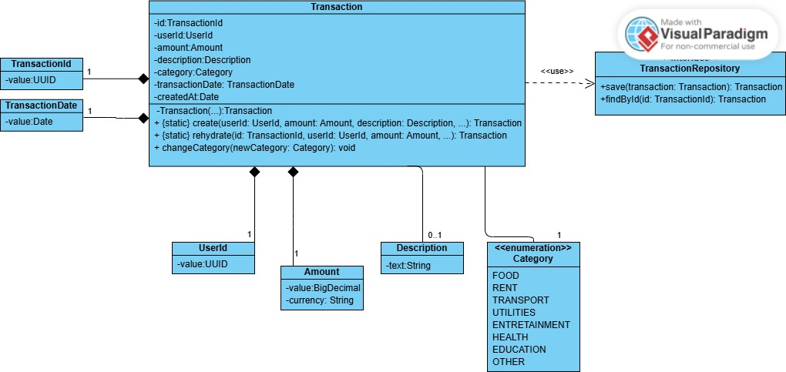
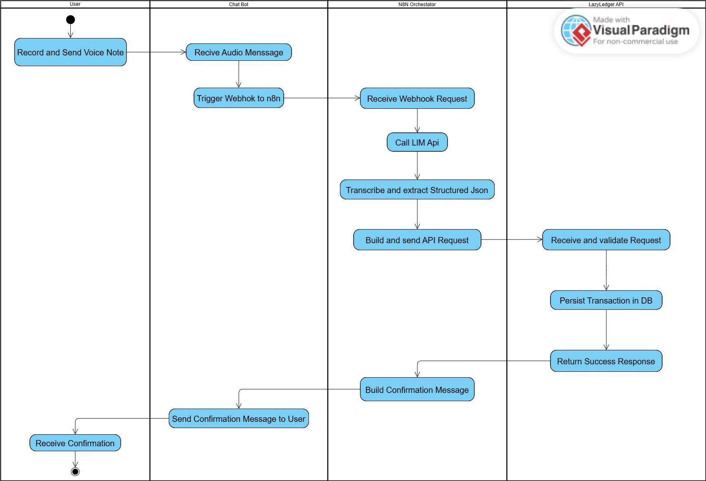

# 🧉 LazyLedger: A Voice-Based Finance Ledger

A backend project designed to explore a low-friction data capture solution, built on solid domain design and clean architecture principles.

## 1. The Problem: The Friction of Manual Recording

My experience with expense management applications has been consistently short-lived. I've identified a fundamental barrier that always leads me to abandon them: the friction of the manual data entry process.

The cycle is predictable: the act of opening the app and filling out a form for each transaction quickly becomes tedious, leading to postponing records and ultimately abandonment.

## 2. Hypothesis and Objective

**Hypothesis:** If recording an expense were as easy as sending an audio, the success rate would increase dramatically.

**Project Objective:** Build a robust backend that can serve as the core for a voice-based transaction recording application.

## 3. Domain Design (Current State: Foundation Complete!)

The heart of the application is its domain model. The design has focused on creating a solid foundation, technology-agnostic and highly maintainable before writing any other layer of the system.

The Transaction entity protects its own state (immutability, no setters) and is created through static factory methods. The use of Value Objects (TransactionId, Amount, etc.) ensures type safety and adds business context to the code.

This diagram represents the current and complete state of the domain model:

*(Note: Link to your domain class diagram)*

## Activity Diagram

This diagram shows the happy path flow of the application:

## 4. Transcription Module: Multi-Modal to Transaction Processing

The core innovation of LazyLedger is its ability to convert various input types (voice, images, documents, text) into structured financial transactions using advanced AI.

### Architecture:
- **Transcriber Interface**: Defines the contract for converting binary data to plain text.
- **AudioTranscriber**: Implements transcription for audio files using Google Gemini LLM.
- **ImageTranscriber**: Placeholder for OCR-based image transcription.
- **DocTranscriber**: Placeholder for document parsing to text.
- **TranscriberFactory**: Strategy pattern factory for selecting the appropriate transcriber based on media type.
- **TranscriptionService**: Orchestrates transcription and data extraction, returning TransactionDataDto list.
- **DataExtractor**: Static utility that analyzes transcription text with specialized financial prompts to extract transaction data.

### LLM Integration:
- **Multi-Phase Processing**: Binary Data → Plain Text → Structured Transaction Data
- **Business Rule Enforcement**: LLM follows strict financial categorization rules (positive amounts = INCOME, specific expense categories, ISO currency codes).
- **Date Handling**: Uses LLM-extracted dates when available, falls back to server date when not specified.

### Example Processing:
Input: WhatsApp voice note "Hoy he gastado veinte dólares en comida."
- **Phase 1 (Transcription)**: Audio → "Hoy he gastado veinte dólares en comida."
- **Phase 2 (Extraction)**: Text → {amount: -20.00, currency: "USD", category: "FOOD", description: "Comida"}

## 5. Telegram Bot Integration: Real-Time Message Processing

LazyLedger now integrates with Telegram Bot API to capture messages in real-time and process them automatically.

### Architecture:
- **ApiListener Interface**: Defines the contract for processing incoming updates.
- **TelegramApiListener**: Adapter that extracts raw message data (text, binary files) from Telegram updates.
- **MessageDto**: Universal DTO containing chatId, content, msg (caption), and binaryData.
- **LazyLedgerBot**: Telegram bot implementation using long polling for message reception.
- **MessageProcessorService**: Orchestrates transcription, extraction, and persistence, with asynchronous feedback to users.

### Features:
- **Multi-Media Support**: Handles text, audio, images, documents, and videos.
- **Binary Processing**: Downloads and transcribes files to plain text for LLM processing.
- **Asynchronous Feedback**: Sends confirmation messages to users after transaction saving, including transaction code.
- **Transaction Codes**: Sequential ID per user for UX (e.g., TX-001), with internal UUID for machine processing.

### User Experience:
1. User sends voice/image/document to bot.
2. System transcribes to text, extracts transaction data, saves to DB.
3. Bot replies: "Se ha guardado. Ha registrado un gasto de $20.00 USD en fecha 2025-09-24. Código de transacción: TX-001"

## 6. Selected Technology Stack

The implementation of this domain is being done with an enterprise-grade stack, focused on robustness and best practices.

- **Language:** Java 21 (OpenJDK).
- **Framework:** Spring Boot 3.2.0 (with Spring Web, Spring Data JPA).
- **Database:** PostgreSQL with UTF-8 encoding.
- **ORM:** Hibernate (via Spring Data JPA).
- **AI Integration:** Google Gemini LLM for multi-modal transcription and financial data extraction.
- **Bot Integration:** Telegram Bot API for real-time message processing.
- **Build Tool:** Maven.
- **Testing:** JUnit 5 with Spring Boot Test.
- **Design Principles:** Rich Domain Model, Clean Architecture, Strategy Pattern, Dependency Injection, Immutability.

## 7. Project Status and Next Steps

### Current Status:
✅ Domain Model (domain) defined and fully implemented. Includes the Transaction entity, Value Objects, and the TransactionRepository interface.
✅ Infrastructure layer (infrastructure) implemented using Spring Data JPA and PostgreSQL.
✅ RESTful API (api) built with Spring Boot to expose CRUD operations with standardized ApiResponse format.
✅ Transcription Module implemented with Google Gemini LLM integration for multi-modal (audio, image, document) to text transcription and financial data extraction.
✅ Telegram Bot Integration: Real-time message capture, binary file processing, transaction extraction, and asynchronous user feedback.
✅ MVP Core Features: Multi-media input processing, automated transaction creation, and user notifications.

### Considerations:
- **Transaction IDs**: UUID for internal machine processing, sequential per-user codes (e.g., TX-001) for UX.
- **Security**: Sensitive configs (API keys, tokens) excluded from git, prepared for secret vault integration.
- **Architecture**: Clean separation with adapters for external APIs, strategy pattern for transcribers.

### Next Steps:
🔜 Implement sequential transaction codes per user.
🔜 Add user authentication and multi-user support.
🔜 Deploy with secret management (vault).
🔜 Implement transaction categorization improvements and reporting features.